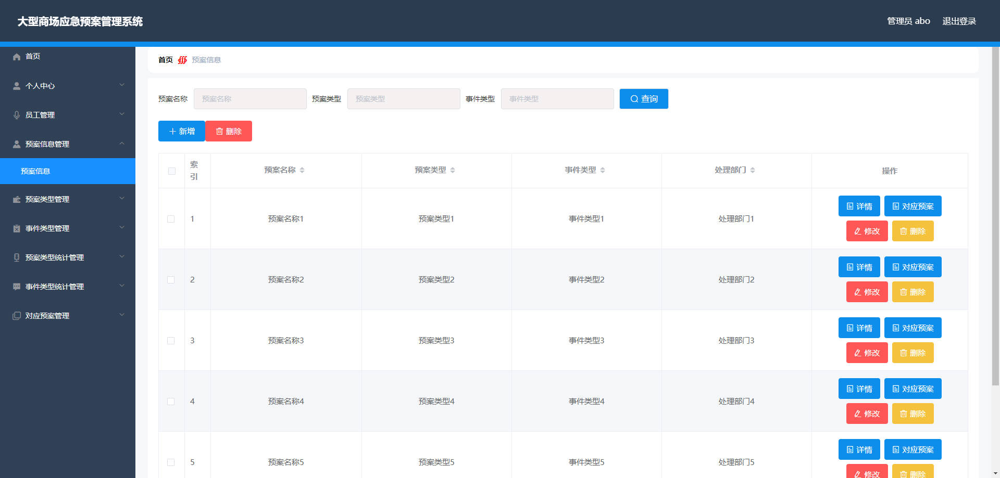
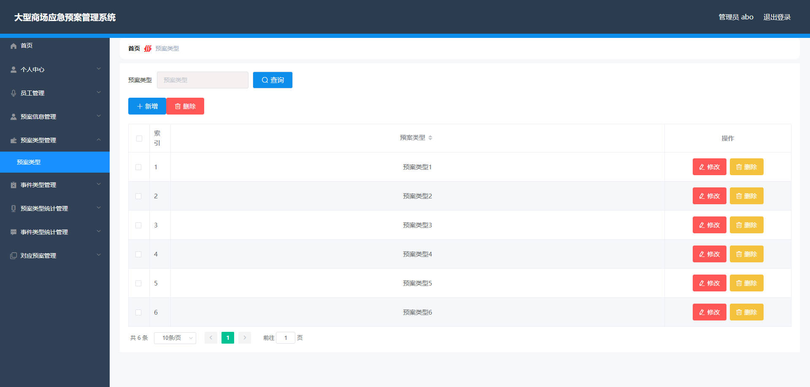
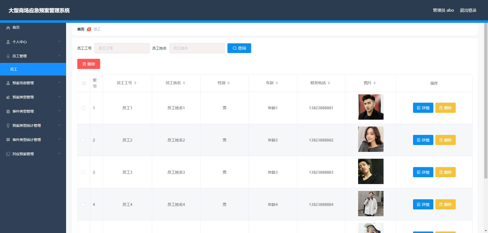
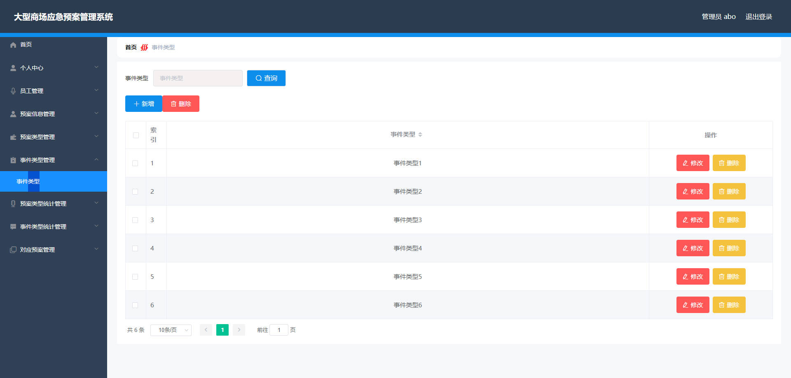
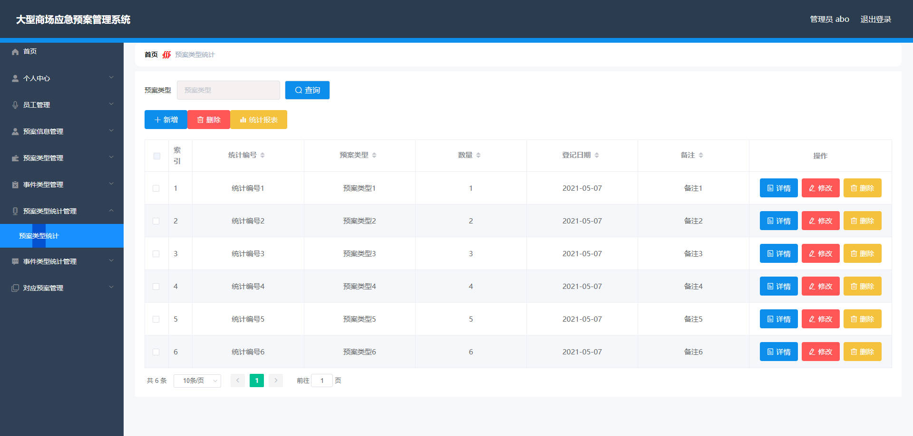
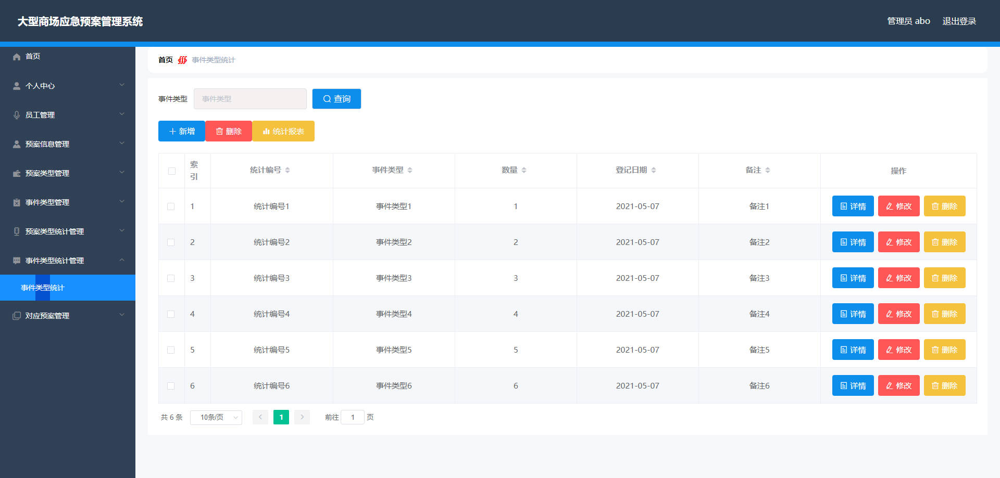
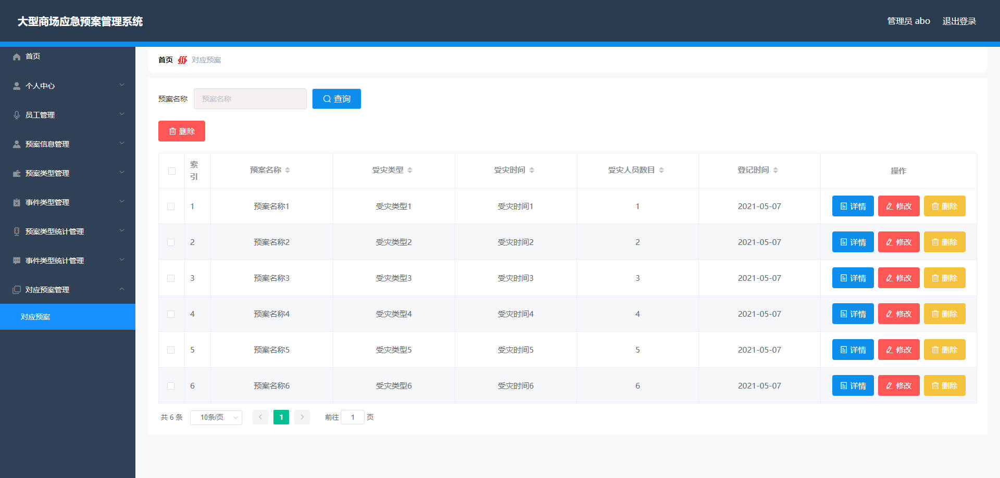
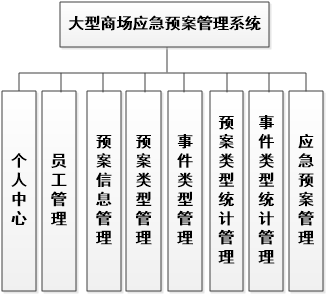
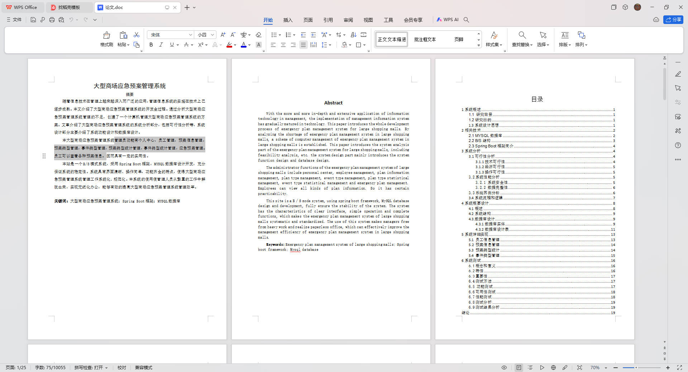

# 基于Springboot的大型商场应急预案管理系统

## Springboot-0099


## 技术栈

Springboot mybatisplus vue mysql maven


## 数据库表(10张)


## 功能介绍

```properties
管理员功能有个人中心，员工管理，预案信息管理，预案类型管理，事件类型管理，预案类型统计管理，事件类型统计管理，应急预案管理。员工可以查看各种预案信息。


```


## 图片

### 前台

### 后台











## 访问路径

### 前台

```properties
http://localhost:8080/springbootwk338/front/pages/login/login.html

账号 员工6
密码 123456
```

### 后台

```properties
http://localhost:8080/springbootwk338/admin/dist/index.html#/login

账号 abo
密码 abo
```


## 功能图




## 文档目录




## 打赏或交流


